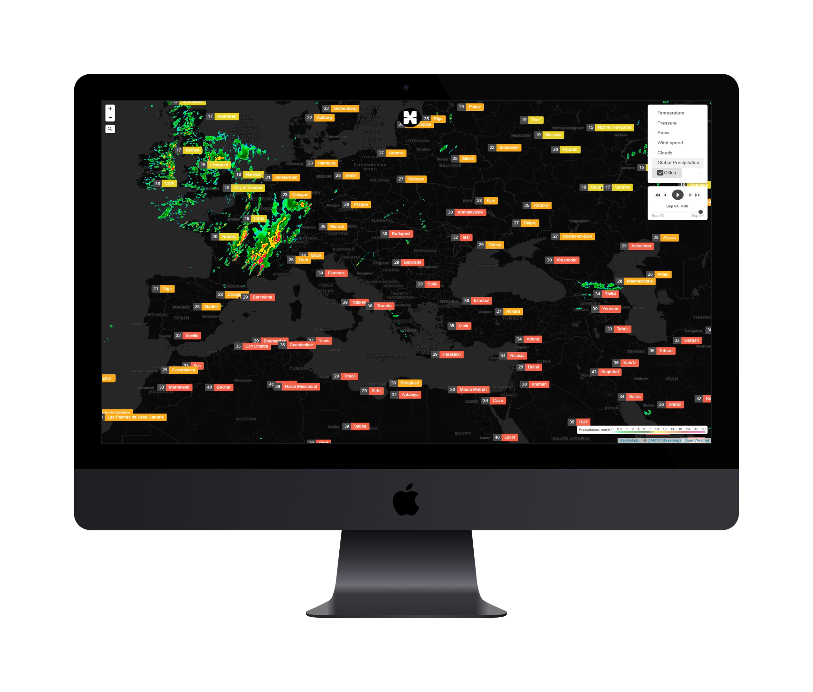

# Weather AI
Using LeafLet to Visualize Weather AI by HauHet plc.

# Leaflet Challenge
Using the Leaflet Javascript Library to Visualize  Weather AI

# Description
OpenWeatherMap (OWM) is a service providing weather related data, visualizing it using an OpenLayers based map. This is an independant Leaflet based script providing easy access to OWM's features for Leaflet based maps.
In short: An independant JavaScript library for including OWM's layers and OWM's current city data in Leaflet based maps.

# Demo
 [Live Data](https://hauhet.co/app/Weather/).
 Its "Wind Rose" overlay is an example of a user defined marker to give you an idea what can be achieved by user defined functions for markers. This map is available in the example directory, too.

 ## Contents

   * Project Overview
   * Problem Statement and approach to solution
   * Metrics 
   * Dataset 
   * Exploratory Data Analysis and Data processing
   * Model implementation
   * Improvement and evaluation
   * Prediction and web application
   * Improvement and conclusion
   * acknowledgement

## Sources of data and Thanks❤️

*   Real-time earthquake data from [OpenWeather](https://openweathermap.org/)  
*   Maps used from [Mapbox](https://www.mapbox.com/) and [CartoDB](https://carto.com/)
*   World tectonic plates and boundaries from [fraxen](https://github.com/fraxen/tectonicplates)
*   Exterior design from [Mudi.ui](https://www.mdui.org/)
*   Map framework using the [Leaflet.js](https://leafletjs.com/) library
*   Data visualization using [D3.js](https://d3js.org/) library

 

### Copyright

HauHet plc. © 2023-2025. All Rights Reserved. [HauHet plc.](https://hauhet.co/)
